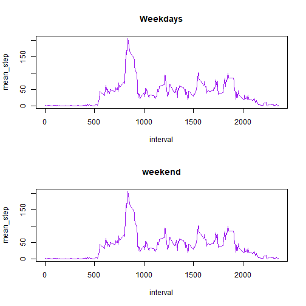

Exploratory Data Analysis Course Project 1
======================================================


```r
library(dplyr)
```

```
## Warning: package 'dplyr' was built under R version 3.5.2
```

```
## 
## Attaching package: 'dplyr'
```

```
## The following objects are masked from 'package:stats':
## 
##     filter, lag
```

```
## The following objects are masked from 'package:base':
## 
##     intersect, setdiff, setequal, union
```

Part 1
========================================================

load the data

```r
activity_data <- read.csv("activity.csv")
head(activity_data)
```

```
##   steps       date interval
## 1    NA 2012-10-01        0
## 2    NA 2012-10-01        5
## 3    NA 2012-10-01       10
## 4    NA 2012-10-01       15
## 5    NA 2012-10-01       20
## 6    NA 2012-10-01       25
```

```r
str(activity_data)
```

```
## 'data.frame':	17568 obs. of  3 variables:
##  $ steps   : int  NA NA NA NA NA NA NA NA NA NA ...
##  $ date    : Factor w/ 61 levels "2012-10-01","2012-10-02",..: 1 1 1 1 1 1 1 1 1 1 ...
##  $ interval: int  0 5 10 15 20 25 30 35 40 45 ...
```

total number of steps taken per day

```r
total_steps <- with(activity_data, tapply(steps, date, sum, na.rm = T))
head(total_steps)
```

```
## 2012-10-01 2012-10-02 2012-10-03 2012-10-04 2012-10-05 2012-10-06 
##          0        126      11352      12116      13294      15420
```

histogram of total steps

```r
hist(total_steps, col = "blue")
```


mean steps taken each day

```r
mean_steps <- with(activity_data, tapply(steps, date, mean, na.rm = T))
head(mean_steps)
```

```
## 2012-10-01 2012-10-02 2012-10-03 2012-10-04 2012-10-05 2012-10-06 
##        NaN    0.43750   39.41667   42.06944   46.15972   53.54167
```

median steps taken each day

```r
median_steps <- with(activity_data, tapply(steps, date, median, na.rm = T))
head(median_steps)
```

```
## 2012-10-01 2012-10-02 2012-10-03 2012-10-04 2012-10-05 2012-10-06 
##         NA          0          0          0          0          0
```

Part 2
==========================================

Time series plot of intervals and mean steps

```r
int_ave_steps <- with(activity_data, tapply(steps, as.factor(interval), mean, na.rm = T))
plot(names(int_ave_steps), int_ave_steps, type = "l", 
     col = "blue", xlab = "Interval", ylab = "Average Number of Steps", main = "Average Number of Steps Taken Each Interval of a Day")
```


which interval has the max average number of steps

```r
which.max(int_ave_steps)
```

```
## 835 
## 104
```

Part 3
============================================

number of missing values

```r
total_na <- sum(is.na(activity_data$steps))
total_na
```

```
## [1] 2304
```

fill in the missing values with mean of intervals

```r
mean_step_interval <- activity_data %>% group_by(interval) %>% summarise(mean_step = mean(steps, na.rm = T))
```

```
## Warning: package 'bindrcpp' was built under R version 3.5.2
```

```r
activity_data_new <- merge(activity_data, mean_step_interval, by = "interval", all.x = T)
activity_data_new$steps[is.na(activity_data_new$steps)] <- activity_data_new[is.na(activity_data_new$steps), ]$mean_step
```

new data set with missing data filled in

```r
activity_data_new <- arrange(activity_data_new, date, interval)
activity_data_new <- activity_data_new %>% select(-mean_step)
head(activity_data_new)
```

```
##   interval     steps       date
## 1        0 1.7169811 2012-10-01
## 2        5 0.3396226 2012-10-01
## 3       10 0.1320755 2012-10-01
## 4       15 0.1509434 2012-10-01
## 5       20 0.0754717 2012-10-01
## 6       25 2.0943396 2012-10-01
```

total number of steps taken per day - new data

```r
total_steps_new <- with(activity_data_new, tapply(steps, date, sum, na.rm = T))
head(total_steps_new)
```

```
## 2012-10-01 2012-10-02 2012-10-03 2012-10-04 2012-10-05 2012-10-06 
##   10766.19     126.00   11352.00   12116.00   13294.00   15420.00
```

histogram of total steps - new data

```r
hist(total_steps_new, col = "blue")
```


mean steps - new data

```r
mean_steps_new <- with(activity_data_new, tapply(steps, date, mean, na.rm = T))
head(mean_steps_new)
```

```
## 2012-10-01 2012-10-02 2012-10-03 2012-10-04 2012-10-05 2012-10-06 
##   37.38260    0.43750   39.41667   42.06944   46.15972   53.54167
```

median steps - new data

```r
median_steps_new <- with(activity_data_new, tapply(steps, date, median, na.rm = T))
head(median_steps_new)
```

```
## 2012-10-01 2012-10-02 2012-10-03 2012-10-04 2012-10-05 2012-10-06 
##   34.11321    0.00000    0.00000    0.00000    0.00000    0.00000
```

Part 4
===================================================

weekday/weekend

```r
activity_data_new <- activity_data_new %>% mutate(day = weekdays(as.Date(date)))
activity_data_new <- activity_data_new %>% mutate(day = if_else(day %in% c("Sunday", "Saturday"), "weekend", "weekday"))
head(activity_data_new)
```

```
##   interval     steps       date     day
## 1        0 1.7169811 2012-10-01 weekday
## 2        5 0.3396226 2012-10-01 weekday
## 3       10 0.1320755 2012-10-01 weekday
## 4       15 0.1509434 2012-10-01 weekday
## 5       20 0.0754717 2012-10-01 weekday
## 6       25 2.0943396 2012-10-01 weekday
```

Time series plot of intervals and mean steps for weekday/weekend

```r
mean_step_interval_new <- activity_data_new %>% group_by(interval) %>% summarise(mean_step = mean(steps, na.rm = T))
activity_data_new <- merge(activity_data_new, mean_step_interval_new, by = "interval", all.x = T)
par(mfrow = c(2,1)) 
with(subset(activity_data_new, day = "weekday"), plot(interval, mean_step, type = "l", main = "Weekdays", col = "purple"))
with(subset(activity_data_new, day = "weekend"), plot(interval, mean_step, type = "l", main = "weekend", col = "purple"))
```


